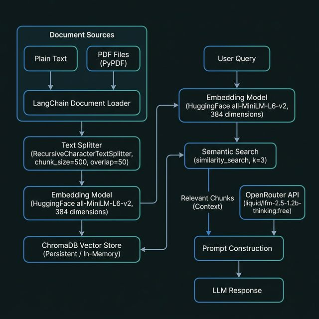

# 🔍 RAG Project — Retrieval-Augmented Generation with LangChain

> A hands-on, progressive learning project demonstrating how to build **Retrieval-Augmented Generation (RAG)** pipelines from scratch using **LangChain**, **ChromaDB**, **HuggingFace Embeddings**, and **OpenRouter** as a free LLM provider.

---

## 📖 Table of Contents

- [What is RAG?](#-what-is-rag)
- [Architecture](#-architecture)
- [Project Structure](#-project-structure)
- [Notebooks Overview](#-notebooks-overview)
- [Tech Stack](#-tech-stack)
- [Setup & Installation](#-setup--installation)
- [Environment Variables](#-environment-variables)
- [Key Concepts](#-key-concepts)
- [Data Sources Used](#-data-sources-used)

---

## 🤔 What is RAG?

**Retrieval-Augmented Generation (RAG)** is an AI architecture pattern that improves the quality and accuracy of LLM responses by grounding them in relevant external knowledge retrieved at query time.

Instead of relying purely on what the LLM learned during training, RAG:

1. **Stores** your documents as vector embeddings in a vector database
2. **Retrieves** the most semantically relevant chunks when a user asks a question
3. **Augments** the LLM's prompt with this retrieved context
4. **Generates** a grounded, context-aware response

This solves two major LLM problems: **hallucination** and **lack of domain-specific knowledge**.

---

## 🏗️ Architecture



### Pipeline Breakdown

| Stage | Tool Used | Description |
|-------|-----------|-------------|
| **Document Loading** | `LangChain Document`, `PyPDFLoader` | Load raw text or PDFs into LangChain Document objects |
| **Text Splitting** | `RecursiveCharacterTextSplitter` | Split long documents into overlapping chunks (`size=500`, `overlap=50`) |
| **Embedding** | `HuggingFace all-MiniLM-L6-v2` | Convert text chunks into 384-dimensional dense vectors (free, local) |
| **Vector Store** | `ChromaDB` | Store and index embeddings for fast similarity search |
| **Retrieval** | `similarity_search(k=3)` | Find the top-3 most semantically relevant chunks for a query |
| **LLM Generation** | `OpenRouter API` | Use a free LLM to generate an answer grounded in the retrieved context |

---

## 📁 Project Structure

```
RAG_Project/
│
├── 📓 1.0_RAG_With_own_text.ipynb       # RAG with plain text input
├── 📓 2.0_RAG_With_own_pdf.ipynb        # RAG with PDF document (Indian Constitution)
├── 📓 3.0_RAG_With_Save_Vector_data.ipynb  # Load & reuse a persisted ChromaDB store
├── 📓 4.0_RAG_Add_Doc.ipynb             # Add new PDF documents to existing vector store
│
├── 📁 docs/
│   ├── content.pdf                      # The Constitution of India (402 pages)
│   ├── content2.pdf                     # The Constitution of the United States (15 pages)
│   └── rag_architecture.png             # Architecture diagram
│
├── 📁 vector/                           # Persisted ChromaDB vector store
│   └── chroma.sqlite3
│
├── main.py                              # Entry point (placeholder)
├── pyproject.toml                       # Project dependencies (uv)
├── uv.lock                              # Locked dependency versions
├── .env                                 # API keys (not committed)
├── .env.example                         # Template for environment variables
└── .gitignore
```

---

## 📓 Notebooks Overview

### `1.0_RAG_With_own_text.ipynb` — RAG With Plain Text
> **Difficulty:** Beginner | **Concepts:** Documents, Chunking, Embeddings, In-Memory VectorStore, Semantic Search

The foundational notebook. Demonstrates the core RAG pipeline end-to-end with a simple paragraph of text about Artificial Intelligence.

**Steps covered:**
1. Create a `Document` object from plain text with metadata
2. Split into chunks with `RecursiveCharacterTextSplitter` (chunk_size=500, overlap=50)
3. Generate embeddings using `HuggingFaceEmbeddings` (`all-MiniLM-L6-v2`) — **384 dimensions**
4. Store in an **in-memory** `ChromaDB` vector store
5. Perform semantic similarity search (`k=3`)
6. Pass context + query to the LLM and get an answer

```python
# Core pattern
vectorstore = Chroma.from_documents(documents=chunks, embedding=embedding_model)
context = vectorstore.similarity_search("What is AI?", k=3)
response = llm.invoke(f"What is AI? Context: {context}")
```

---

### `2.0_RAG_With_own_pdf.ipynb` — RAG With PDF (Indian Constitution)
> **Difficulty:** Intermediate | **Concepts:** PDF Loading, Large Documents, Real-world QA

Scales the pipeline to work with a **402-page PDF** of the Constitution of India. Demonstrates how to load, split, embed, and query a large real-world legal document.

**Steps covered:**
1. Load PDF with `PyPDFLoader` (extracts text page-by-page with metadata like `page`, `total_pages`, `source`)
2. Split the 402-page document into manageable chunks
3. Embed and store into ChromaDB
4. Query the Constitution (e.g., *"What are the Fundamental Rights?"*)
5. Get an LLM-synthesized answer grounded in the actual constitutional text

```python
from langchain_community.document_loaders import PyPDFLoader

loader = PyPDFLoader("./docs/content.pdf")
docs = loader.load()  # Returns 402 Document objects (one per page)
```

---

### `3.0_RAG_With_Save_Vector_data.ipynb` — Persisted Vector Store
> **Difficulty:** Intermediate | **Concepts:** Persistence, Vector Store Reuse, Cost Efficiency

Shows how to **save** embeddings to disk so you don't have to re-embed documents every time. Demonstrates loading an already-populated ChromaDB store and querying it directly.

**Key insight:** Embedding once and reusing is critical for production — embedding a 400+ page document every run would be slow and wasteful.

```python
# Load existing vector store from disk (no re-embedding needed)
vectorstore = Chroma(
    embedding_function=embedding_model,
    persist_directory="./vector/"
)

context = vectorstore.similarity_search("What is in the Tenth Schedule?", k=3)
```

---

### `4.0_RAG_Add_Doc.ipynb` — Adding New Documents
> **Difficulty:** Intermediate | **Concepts:** Incremental Updates, Multi-document RAG

Demonstrates how to **add a new document** (US Constitution PDF) to an existing ChromaDB vector store that already contains the Indian Constitution. This simulates a real-world scenario where you grow your knowledge base over time.

**Documents in the final vector store:**
- 🇮🇳 Constitution of India (`content.pdf` — 402 pages)
- 🇺🇸 Constitution of the United States (`content2.pdf` — 15 pages)

```python
# Load new document and add to existing store
loader = PyPDFLoader("./docs/content2.pdf")
new_docs = loader.load()
chunks = splitter.split_documents(new_docs)
vectorstore.add_documents(chunks)  # Incremental addition
```

---

## 🛠️ Tech Stack

| Component | Library / Tool | Version | Purpose |
|-----------|---------------|---------|---------|
| **LLM** | OpenRouter API | — | Free LLM access (`liquid/lfm-2.5-1.2b-thinking:free`) |
| **LLM Interface** | `langchain-openai` | `>=1.1.11` | OpenAI-compatible client for OpenRouter |
| **Embeddings** | `langchain-huggingface` | `>=1.2.1` | Local HuggingFace embedding model |
| **Embedding Model** | `sentence-transformers` | `>=5.3.0` | `all-MiniLM-L6-v2` (384-dim, fast, free) |
| **Vector Store** | `chromadb` | `>=1.5.5` | Local vector database with persistence |
| **PDF Loader** | `pypdf` | `>=6.9.1` | PDF text extraction |
| **LangChain Core** | `langchain-core` | `>=1.2.19` | Pipelines, documents, prompts |
| **LangChain Community** | `langchain-community` | `>=0.4.1` | Loaders, vector store integrations |
| **Package Manager** | `uv` | — | Fast Python package manager |
| **Runtime** | Python | `>=3.12` | Language runtime |

---

## ⚙️ Setup & Installation

### Prerequisites
- Python 3.12+
- [`uv`](https://docs.astral.sh/uv/) package manager

### 1. Clone the repository
```bash
git clone https://github.com/Ankit455/RAG_Project.git
cd RAG_Project
```

### 2. Create virtual environment
```bash
uv venv .venv
source .venv/bin/activate   # macOS/Linux
# .venv\Scripts\activate    # Windows
```

### 3. Install dependencies
```bash
uv sync
```

### 4. Set up environment variables
```bash
cp .env.example .env
# Edit .env and add your OpenRouter API key
```

### 5. Install Jupyter kernel (for running notebooks)
```bash
uv add ipykernel
python -m ipykernel install --user --name=rag-project
```

### 6. Run notebooks in order
Open Jupyter and run notebooks starting from `1.0_RAG_With_own_text.ipynb`.

---

## 🔐 Environment Variables

Copy `.env.example` to `.env` and fill in your values:

```bash
OPENROUTER_API_KEY="sk-or-v1-your-key-here"
```

Get your **free** OpenRouter API key at [openrouter.ai](https://openrouter.ai).

> ⚠️ The `.env` file is in `.gitignore` and will **never** be committed to version control.

---

## 🧠 Key Concepts

### Why `all-MiniLM-L6-v2` for embeddings?
- **Free** — runs entirely locally, no API cost
- **Fast** — small model (~22M parameters)
- **384 dimensions** — balanced between quality and storage efficiency  
- **Great for RAG** — trained specifically for semantic similarity tasks

### Why OpenRouter instead of OpenAI?
- **Free tier** available with models like `liquid/lfm-2.5-1.2b-thinking:free`
- **OpenAI-compatible API** — works seamlessly with `langchain-openai`
- No credit card required to get started

> ⚠️ **Note:** OpenRouter does NOT support embeddings. That's why we use local HuggingFace embeddings separately.

### Chunking Strategy
```
chunk_size = 500 characters
chunk_overlap = 50 characters
splitter = RecursiveCharacterTextSplitter
```
- **`chunk_size=500`** — small enough to be semantically focused, large enough for context
- **`chunk_overlap=50`** — ensures important context at chunk boundaries isn't lost
- **`RecursiveCharacterTextSplitter`** — splits by `\n\n`, `\n`, ` `, `""` in order, preserving natural text boundaries

### ChromaDB Persistence
```
In-memory:  Chroma.from_documents(...)         # Lost when notebook closes
On-disk:    Chroma(persist_directory="./vector/")  # Survives restarts
```

---

## 📚 Data Sources Used

| File | Source | Pages | Language | Used In |
|------|--------|-------|----------|---------|
| `content.pdf` | Constitution of India (as on 1st May 2024) | 402 | English + Hindi | Notebooks 2.0, 3.0 |
| `content2.pdf` | Constitution of the United States of America (1787) | 15 | English | Notebook 4.0 |

---

## 🔭 Future Improvements

- [ ] Add a **conversational memory** chain (multi-turn QA)
- [ ] Implement a **RetrievalQA** chain using LangChain's built-in chain abstraction
- [ ] Add a **Streamlit** or **Gradio** UI for interactive querying
- [ ] Experiment with different chunking strategies (semantic chunking, markdown-aware, etc.)
- [ ] Try different free embedding models (`BAAI/bge-small-en-v1.5`, `all-mpnet-base-v2`)
- [ ] Add **metadata filtering** in ChromaDB queries
- [ ] Implement **hybrid search** (BM25 + vector similarity)

---

## 📜 License

This project is for educational purposes. The Constitution documents used are public domain.

---

<div align="center">

Built with ❤️ using LangChain · ChromaDB · HuggingFace · OpenRouter

</div>
